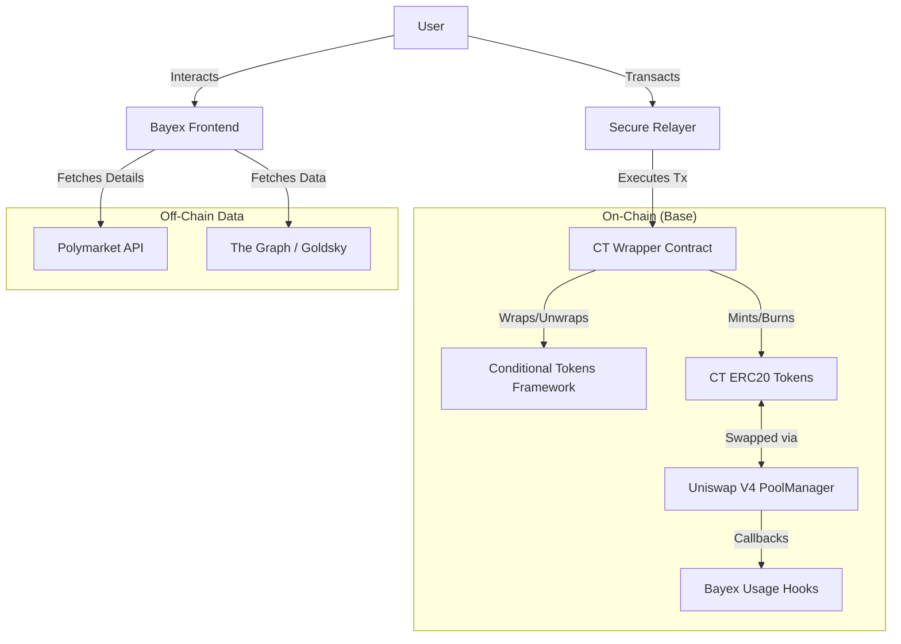

# Architecture Overview

The Bayex Protocol is composed of several key components that interact to facilitate prediction market operations.

## High-Level Diagram

## Components

### 1. Conditional Tokens Framework (CTF)
The backbone of the system, established by Gnosis. It allows for:
- **Splitting**: Collateral is split into outcome tokens (e.g., YES/NO).
- **Merging**: Outcome tokens are merged back into collateral.
- **Redemption**: Winning outcome tokens are redeemable for the collateral.

### 2. CT Wrapper
A custom contract that wraps the ERC1155 tokens from the CTF into standard **ERC20** tokens. This is crucial for compatibility with Uniswap V4, which operates on ERC20s.
- **ERC1155 Interaction**: Handles the `safeBatchTransferFrom` from CTF.
- **ERC20 Minting**: Mints a distinct ERC20 for each outcome (e.g., `CT-YES`, `CT-NO`).

### 3. Uniswap V4 Integration
Bayex utilizes Uniswap V4 for liquidity provision and trading.
- **PoolManager**: Manages the liquidity pools for the Conditional Token ERC20s.
- **Hooks**: Custom logic executed before/after swaps and modifications. This ensures correct pricing and interaction with the CT Wrapper.

### 4. Frontend & Indexing
- **Frontend**: A Next.js application using `wagmi` and `viem`.
- **Indexing**: Uses The Graph/Goldsky to index `TokenDeployed` and other events to quickly populate the UI with available markets.
- **External Data**: Enriches market data (titles, icons, descriptions) by cross-referencing with the Polymarket API using the `conditionId`.
